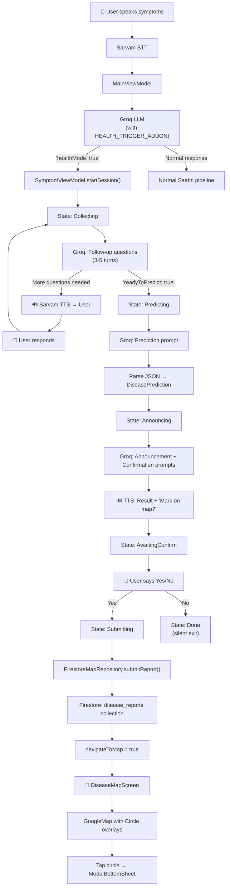

# Saathi — Community Disease Map & Symptom Analysis Pipeline

## Feature Overview

This document details the **Community Disease Mapping** feature added to Saathi — a voice-first AI assistant for rural India. The feature allows users to describe health symptoms via voice, receive an AI-driven preliminary assessment, and optionally contribute an anonymous disease report to a real-time community map visible to all users in the area.

The entire interaction is **zero-reading-required** — driven entirely through voice (STT → LLM → TTS), matching Saathi's existing design philosophy for low-literacy users.

---

## Architecture Diagram



---

## File Inventory

### New Files Created (7)

| File | Package | Purpose |
|------|---------|---------|
| `DiseaseReport.kt` | `map/` | Firestore data model with `fromFirestore()` factory and `toFirestore()` serializer |
| `FirestoreMapRepository.kt` | `map/` | Firestore write (`submitReport`) and real-time read (`observeReports` via `callbackFlow`) |
| `DiseaseMapViewModel.kt` | `map/` | UI state holder for the map screen — subscribes to Firestore, fetches GPS, manages report selection |
| `SymptomSession.kt` | `symptom/` | Immutable data models: `SymptomSession`, `SymptomTurn`, `DiseasePrediction`, `DiseaseCategory` enum |
| `SymptomPrompts.kt` | `symptom/` | All LLM prompt templates for the symptom analysis pipeline |
| `SymptomViewModel.kt` | `symptom/` | State machine driving the entire symptom conversation flow |
| `DiseaseMapScreen.kt` | `ui/map/` | Full-screen Google Maps composable with disease circles and detail bottom sheet |

### Modified Files (6)

| File | Changes |
|------|---------|
| `build.gradle.kts` | Added 5 dependencies: `firebase-firestore-ktx`, `play-services-location`, `kotlinx-coroutines-play-services`, `maps-compose`, `play-services-maps`. Added `MAPS_API_KEY` manifest placeholder. |
| `AndroidManifest.xml` | Added `ACCESS_FINE_LOCATION`, `ACCESS_COARSE_LOCATION` permissions and `com.google.android.geo.API_KEY` meta-data |
| `MainViewModel.kt` | Added location StateFlow, GPS fetch, SymptomViewModel instance, health-mode detection, STT routing gate, `speakViaSarvam()` helper |
| `MainScreen.kt` | Added location permission launcher, `navController` param, Map icon button (top-right) |
| `MainActivity.kt` | Added `navigateToMap` observer triggering navigation to `disease_map` route |
| `NavGraph.kt` | Added `DISEASE_MAP` route, threaded `application` and `navController` params |

---

## Pipeline Detail — Phase by Phase

### Phase 1: Firestore Setup

**What**: Cloud database layer for storing and reading disease reports.

**`DiseaseReport`** is the core data model:
```kotlin
data class DiseaseReport(
    id, lat, lng, disease, accuracy, symptoms, reasoning,
    category, language, userId, timestamp, radius (always 500)
)
```

It includes:
- `fromFirestore(doc)` — factory that safely parses a Firestore `DocumentSnapshot`, with null-safe defaults for every field
- `toFirestore()` — returns a `Map<String, Any>` for Firestore writes

**`FirestoreMapRepository`** encapsulates all Firestore I/O:
- `submitReport(report)` — `suspend` function, writes to `disease_reports` collection using `kotlinx-coroutines-tasks` `await()`, returns `Result<Unit>`
- `observeReports()` — returns a `Flow<List<DiseaseReport>>` via `callbackFlow`, wrapping Firestore's `addSnapshotListener`. Ordered by `timestamp DESC`. Errors are logged but don't close the flow (Firestore auto-retries).

**Security rules** (set manually in Firebase Console):
```
allow read: if true;
allow write: if request.auth != null;
```

---

### Phase 2: Location Setup

**What**: GPS location available as a `StateFlow` throughout the app.

- `FusedLocationProviderClient.getCurrentLocation()` with `PRIORITY_HIGH_ACCURACY`
- Falls back to `lastLocation` if `getCurrentLocation` returns null
- `userLocation: StateFlow<Pair<Double, Double>?>` on `MainViewModel` — starts `null`, populated once permission is granted
- Permission requested via `ActivityResultContracts.RequestPermission` in `MainScreen` on first composition
- If denied: location stays `null`, symptom flow still works but the map report gets `(0.0, 0.0)` coordinates

---

### Phase 3: Symptom Data Layer

**What**: All data models and LLM prompts — no UI, no ViewModels.

#### Data Models (`SymptomSession.kt`)

| Type | Fields | Notes |
|------|--------|-------|
| `SymptomTurn` | `role`, `content` | One voice exchange ("user" or "assistant") |
| `DiseaseCategory` | enum with 6 values | Each carries a `hexColor` for map circles. `fromString()` defaults to `UNKNOWN` |
| `DiseasePrediction` | `disease`, `accuracy`, `symptoms`, `reasoning`, `category` | Structured LLM output |
| `SymptomSession` | `id`, `language`, `lat`, `lng`, `turns`, `collectedSymptoms`, `prediction` | Immutable; `addTurn()` returns a new copy |

#### LLM Prompts (`SymptomPrompts.kt`)

| Prompt | When Used | What It Does |
|--------|-----------|--------------|
| `HEALTH_TRIGGER_ADDON` | Appended to existing Saathi system prompt | Instructs Groq to return `{"healthMode": true}` if user describes any physical symptom — overrides all other instructions |
| `followUpSystemPrompt(language)` | During `Collecting` state | Medical intake assistant in user's language. Asks ONE question per turn. Returns `{"readyToPredict": true, "collectedSymptoms": [...]}` after 3–5 turns |
| `predictionSystemPrompt()` | During `Predicting` state | One-shot JSON prediction: disease name, accuracy (40–95%), symptoms, reasoning, category |
| `predictionAnnouncementPrompt(prediction, language)` | During `Announcing` state | Warm result announcement in user's language, advises seeing a doctor |
| `mapConfirmationPrompt(disease, accuracy, language)` | During `AwaitingConfirm` state | Asks user if they want to anonymously mark this on the community map |

---

### Phase 4: SymptomViewModel — The State Machine

**What**: Drives the entire multi-turn symptom conversation.

#### State Flow

```
Idle → Collecting → Predicting → Announcing → AwaitingConfirm → Submitting → Done
                                                                 ↘ (user says no) → Done
```

#### Key Design Decisions

1. **No direct audio access** — SymptomViewModel only emits text via `ttsOutput: StateFlow<String?>` and receives text via `onUserSpoke(text)`. All STT/TTS is handled by MainViewModel's existing pipeline.

2. **Single `currentJob`** — Each coroutine launch cancels the previous one, preventing stacked Groq API calls if the user speaks twice quickly.

3. **Combined TTS emissions** — Announcement + confirmation question are concatenated into one `ttsOutput` emission to avoid StateFlow conflation (where rapid emissions would drop the first value).

4. **Markdown fence stripping** — `stripMarkdownJson()` handles cases where the LLM wraps JSON in triple-backtick json blocks.

5. **Multi-language yes/no detection** — `isAffirmative()` checks against yes-words in 8 Indian languages (Hindi, Kannada, Telugu, Tamil, Marathi, Bengali, Gujarati, Urdu) plus English.

6. **Factory-free instantiation** — No Hilt. Matches the app's existing DI pattern: `SymptomViewModel` takes `GroqApiService`, `FirestoreMapRepository`, and `groqApiKey` as constructor params.

#### Exposed API

| Member | Type | Consumer |
|--------|------|----------|
| `state` | `StateFlow<SymptomState>` | MainViewModel reads `isSymptomModeActive` |
| `ttsOutput` | `StateFlow<String?>` | MainViewModel feeds into Sarvam TTS |
| `navigateToMap` | `StateFlow<Boolean>` | MainActivity triggers navigation |
| `startSession()` | function | Called when healthMode detected |
| `onUserSpoke()` | function | Called with every STT transcript during active session |
| `resetNavigation()` | function | Called after navigation is triggered |

---

### Phase 5: Wiring into MainViewModel

**What**: Connects the symptom flow into the existing voice pipeline without breaking anything.

#### Changes to the existing Groq system prompt
`SymptomPrompts.HEALTH_TRIGGER_ADDON` is appended to the end of the system prompt. This is a high-priority instruction that overrides the normal response when health symptoms are detected.

#### Health-mode detection
After every Groq response in `stopListeningAndProcess()`:
```kotlin
if (rawResponse.contains(Regex(""""healthMode"\s*:\s*true"""))) {
    symptomViewModel.startSession(transcript, language, lat, lng)
    // Start observing ttsOutput
    return@launch  // Skip normal response pipeline
}
```

#### STT routing gate
Before the language resolution + Groq call, a new check:
```kotlin
if (isSymptomModeActive) {
    symptomViewModel.onUserSpoke(transcript)
    // Observe ttsOutput for this turn
    return@launch  // Skip normal pipeline entirely
}
```

#### Extracted `speakViaSarvam()`
The TTS call was extracted from the inline processing block into a reusable `suspend fun speakViaSarvam(text, sarvamCode)` so both the normal pipeline and the symptom TTS observer can share it.

---

### Phase 6: Maps Setup

**What**: Project-level preparation for Google Maps.

- **Dependencies**: `maps-compose:4.3.3` and `play-services-maps:19.0.0`
- **API Key**: `MAPS_API_KEY` from `local.properties` → `manifestPlaceholders` → `AndroidManifest.xml` `<meta-data>`
- **`DiseaseMapViewModel`**: Subscribes to `FirestoreMapRepository.observeReports()` on init, fetches user location once, exposes `DiseaseMapUiState` with `reports`, `userLocation`, `selectedReport`, `isLoading`. Includes an inner `Factory` class for use with `viewModel()`.

---

### Phase 7: Disease Map Screen

**What**: Full Jetpack Compose map UI.

#### Map Layer
- `GoogleMap` fills the entire screen
- `MapProperties(isMyLocationEnabled = true)` shows the blue dot (when permission granted)
- Camera starts centered on India (lat 20.59, lng 78.96, zoom 5) and animates to user location once available

#### Disease Circles
For each `DiseaseReport`:
- **Primary circle**: 500m radius, fill = category color at 40% alpha, stroke = full alpha at 3dp width
- **Owner indicator**: If `report.userId == currentUser.uid`, a second circle is drawn on top with white color, 2dp width, and a `Dash(20f) + Gap(10f)` pattern
- Circles are clickable — tapping calls `viewModel.onReportSelected(report)`

#### Category Colors
| Category | Hex Color | Visual |
|----------|-----------|--------|
| FEVER | `#FF6B6B` | Warm red |
| RESPIRATORY | `#4FC3F7` | Sky blue |
| GASTROINTESTINAL | `#FFB74D` | Orange |
| SKIN | `#F48FB1` | Pink |
| NEUROLOGICAL | `#CE93D8` | Purple |
| UNKNOWN | `#90A4AE` | Grey |

#### Bottom Sheet (on circle tap)
- Disease name — large bold white text
- Accuracy chip — colored pill with percentage (e.g., "85% confidence")
- Symptom tags — horizontal scrollable row of pills
- Relative timestamp — "5m ago", "2h ago", "3d ago"
- "Reported anonymously" — muted text at bottom
- Dismiss by swiping or tapping outside

#### Back Button
- Bottom-left corner, semi-transparent black circle with white back arrow
- Calls `navController.popBackStack()`

---

### Phase 8: Navigation & Final Integration

**What**: End-to-end wiring.

#### Route Registration
`Routes.DISEASE_MAP = "disease_map"` added to the NavHost in `NavGraph.kt`.

#### Manual Map Access
A Map icon button was added to `MainScreen` in the top-right corner (next to Settings). Tapping it navigates directly to `disease_map` — users can browse the community map anytime without going through the symptom flow.

#### Automatic Navigation (post-symptom)
In `MainActivity.kt`:
```kotlin
LaunchedEffect(navigateToMap) {
    if (navigateToMap) {
        navController.navigate(Routes.DISEASE_MAP)
        mainViewModel.symptomViewModel.resetNavigation()
    }
}
```

#### Back Navigation Safety
`popBackStack()` from the map returns to `MainScreen`. The symptom ViewModel is already in `Done` state, so `isSymptomModeActive` is `false` — no risk of re-triggering the symptom flow.

---

## End-to-End Flow Summary

```
1.  User taps mic → starts listening
2.  User says "mujhe bukhaar hai aur sar dard ho raha hai"
3.  Sarvam STT → transcript: "mujhe bukhaar hai aur sar dard ho raha hai"
4.  Groq receives transcript + HEALTH_TRIGGER_ADDON in system prompt
5.  Groq returns: {"healthMode": true}
6.  MainViewModel detects health mode → symptomViewModel.startSession()
7.  SymptomViewModel sends transcript to Groq with followUpSystemPrompt("Hindi")
8.  Groq asks: "कब से बुखार है?" → TTS speaks it
9.  User responds: "कल रात से" → routed to symptomViewModel.onUserSpoke()
10. 2-3 more follow-up turns...
11. Groq returns: {"readyToPredict": true, "collectedSymptoms": ["high fever", "headache", ...]}
12. SymptomViewModel calls Groq with predictionSystemPrompt()
13. Groq returns: {"disease": "Viral Fever", "accuracy": 82, ...}
14. SymptomViewModel generates announcement + confirmation via Groq
15. TTS speaks: "आपको शायद वायरल बुखार हो सकता है... मैप पर दिखाना चाहेंगे?"
16. User says: "हाँ"
17. isAffirmative("हाँ") → true
18. FirestoreMapRepository.submitReport() → Firestore write
19. navigateToMap = true → MainActivity navigates to DiseaseMapScreen
20. Circle appears at user's GPS location with FEVER color (#FF6B6B)
21. User taps circle → bottom sheet shows details
22. User taps back → returns to MainScreen, symptom mode is Idle
```

---

## Dependencies Added

| Dependency | Version | Purpose |
|------------|---------|---------|
| `firebase-firestore-ktx` | BOM-managed | Firestore read/write |
| `play-services-location` | 21.3.0 | GPS via `FusedLocationProviderClient` |
| `kotlinx-coroutines-play-services` | 1.8.1 | `.await()` bridge for GMS Tasks |
| `maps-compose` | 4.3.3 | Jetpack Compose GoogleMap composable |
| `play-services-maps` | 19.0.0 | Google Maps SDK |

## Permissions Added

| Permission | Purpose |
|------------|---------|
| `ACCESS_FINE_LOCATION` | High-accuracy GPS for map reports |
| `ACCESS_COARSE_LOCATION` | Required alongside fine location |
